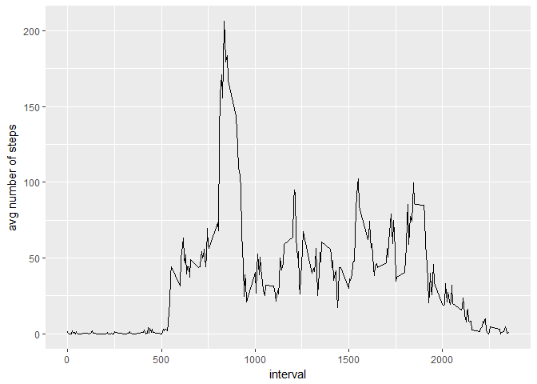
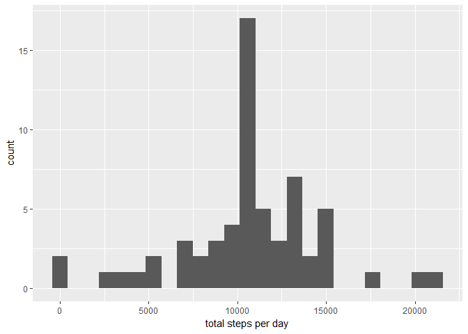
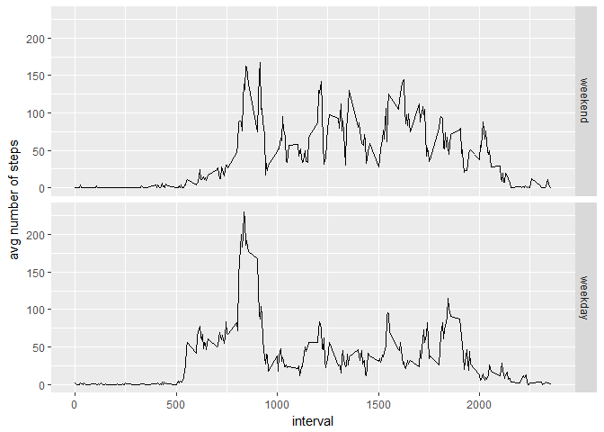

# Reproducible Research: Peer Assessment 1


## Loading and preprocessing the data

### 1 - Load the data:


```r
data <- read.csv("activity/activity.csv")
```

### 2 - Process/transform the data (if necessary) into a format suitable for your analysis

As we already know, the variables are:

- `steps`: Number of steps taking in a 5-minute interval (missing values are coded as NA)
- `date`: The date on which the measurement was taken in YYYY-MM-DD format
- `interval`: Identifier for the 5-minute interval in which measurement was taken

Let's have an initial look at the contents of data:

```r
str(data)
```

```
## 'data.frame':	17568 obs. of  3 variables:
##  $ steps   : int  NA NA NA NA NA NA NA NA NA NA ...
##  $ date    : Factor w/ 61 levels "2012-10-01","2012-10-02",..: 1 1 1 1 1 1 1 1 1 1 ...
##  $ interval: int  0 5 10 15 20 25 30 35 40 45 ...
```

```r
summary(data)
```

```
##      steps                date          interval     
##  Min.   :  0.00   2012-10-01:  288   Min.   :   0.0  
##  1st Qu.:  0.00   2012-10-02:  288   1st Qu.: 588.8  
##  Median :  0.00   2012-10-03:  288   Median :1177.5  
##  Mean   : 37.38   2012-10-04:  288   Mean   :1177.5  
##  3rd Qu.: 12.00   2012-10-05:  288   3rd Qu.:1766.2  
##  Max.   :806.00   2012-10-06:  288   Max.   :2355.0  
##  NA's   :2304     (Other)   :15840
```

The variable `steps` contains *NAs* in 2304 out of 17568 rows. Remove those rows from the dataset:

```r
completeRows <- complete.cases(data)
dataComplete <- data[completeRows,]
```

Convert dates to date objects:

```r
dataClean <- dataComplete
dataClean$date <- as.Date(dataComplete$date, format = "%Y-%m-%d")
```

Check again to see how the processed data looks:

```r
str(dataClean)
```

```
## 'data.frame':	15264 obs. of  3 variables:
##  $ steps   : int  0 0 0 0 0 0 0 0 0 0 ...
##  $ date    : Date, format: "2012-10-02" "2012-10-02" ...
##  $ interval: int  0 5 10 15 20 25 30 35 40 45 ...
```

```r
summary(dataClean)
```

```
##      steps             date               interval     
##  Min.   :  0.00   Min.   :2012-10-02   Min.   :   0.0  
##  1st Qu.:  0.00   1st Qu.:2012-10-16   1st Qu.: 588.8  
##  Median :  0.00   Median :2012-10-29   Median :1177.5  
##  Mean   : 37.38   Mean   :2012-10-30   Mean   :1177.5  
##  3rd Qu.: 12.00   3rd Qu.:2012-11-16   3rd Qu.:1766.2  
##  Max.   :806.00   Max.   :2012-11-29   Max.   :2355.0
```

## What is mean total number of steps taken per day?

### 1 - Make a histogram of the total number of steps taken each day

Compute total number of steps per day and display in a histogram:


```r
dailyTotals <- group_by(dataClean, date) %>% summarize(total = sum(steps))
ggplot(dailyTotals, aes(total)) + geom_histogram(bins = 25) + labs(x = "total steps per day")
```

<!-- -->

### 2 - Calculate and report the mean and median total number of steps taken per day


```r
summary(dailyTotals$total)[c(3,4)]
```

```
##   Median     Mean 
## 10765.00 10766.19
```

## What is the average daily activity pattern?

### 1 - Make a time series plot (i.e. type = "l") of the 5-minute interval (x-axis) and the average number of steps taken, averaged across all days (y-axis)


```r
intervalAvg <- group_by(dataClean, interval) %>% summarize(mean = mean(steps))
ggplot(intervalAvg, aes(x = interval, y =  mean)) + geom_line() + labs(x = "interval", y = "avg number of steps")
```

<!-- -->

### 2 - Which 5-minute interval, on average across all the days in the dataset, contains the maximum number of steps?


```r
m <- matrix(nrow = 1, ncol = 3)
colnames(m) <- c("index", "interval", "num. of steps")
rownames(m) <- c("maximum")
m[1,1] <- which.max(intervalAvg$mean)
m[1,2] <- intervalAvg$interval[m[1,1]]
m[1,3] <- round(intervalAvg$mean[m[1,1]])
m
```

```
##         index interval num. of steps
## maximum   104      835           206
```

## Imputing missing values

### 1 - Calculate and report the total number of missing values in the dataset (i.e. the total number of rows with NAs)


```r
m <- matrix(nrow = 1, ncol = 3)
colnames(m) <- c("steps", "date", "interval")
rownames(m) <- c("number of NAs")
m[1,1] <- length(data$steps[is.na(data$steps)])
m[1,2] <- length(data$date[is.na(data$date)])
m[1,3] <- length(data$interval[is.na(data$interval)])
m
```

```
##               steps date interval
## number of NAs  2304    0        0
```

### 2 - Devise a strategy for filling in all of the missing values in the dataset.

Since what is missing is the number of steps, a reasonable approach would be to use the average number of steps from other days during the same interval. We already have these values from a previous calculation.

### 3 - Create a new dataset that is equal to the original dataset but with the missing data filled in.


```r
dataImputed <- data
for (i in seq_len(nrow(data))) {
  row <- data[i,]
  if (is.na(row[1])) {
    dataImputed[i, 1] <-
      as.data.frame(intervalAvg)[intervalAvg$interval == row[[3]], 2]
  }
}
```

### 4 - Make a histogram of the total number of steps taken each day and Calculate and report the mean and median total number of steps taken per day. Do these values differ from the estimates from the first part of the assignment? What is the impact of imputing missing data on the estimates of the total daily number of steps?


```r
dailyTotals2 <- group_by(dataImputed, date) %>% summarize(total = sum(steps))
ggplot(dailyTotals2, aes(total)) + geom_histogram(bins = 25) + labs(x = "total steps per day")
```

<!-- -->

```r
summary(dailyTotals2$total)[c(3,4)]
```

```
##   Median     Mean 
## 10766.19 10766.19
```
After imputing the data, the mean stays the same, but the median has changed.

## Are there differences in activity patterns between weekdays and weekends?

### 1 - Create a new factor variable in the dataset with two levels - "weekday" and "weekend" indicating whether a given date is a weekday or weekend day.


```r
dataImputed$date <- as.Date(dataImputed$date, format = "%Y-%m-%d")
days <- weekdays(dataImputed$date)
dayType <- as.factor(sapply(days, function(d) {
  if (d == "Samstag" || d == "Sonntag")
    "weekend"
  else
    "weekday"
}))
dataExt <- cbind(dataImputed, dayType)
```

### 2 - Make a panel plot containing a time series plot (i.e. type = "l") of the 5-minute interval (x-axis) and the average number of steps taken, averaged across all weekday days or weekend days (y-axis).


```r
weekendAvg <- dataExt[dayType == "weekend", ] %>% group_by(interval) %>% summarize(mean = mean(steps))
weekdayAvg <- dataExt[dayType == "weekday", ] %>% group_by(interval) %>% summarize(mean = mean(steps))
mergedAvg <- rbind(cbind(weekendAvg, dayType = as.factor(c("weekend"))), cbind(weekdayAvg, dayType = as.factor(c("weekday"))))
ggplot(mergedAvg, aes(x = interval, y =  mean)) + geom_line() + labs(x = "interval", y = "avg number of steps") + facet_grid(dayType ~ .)
```

<!-- -->
